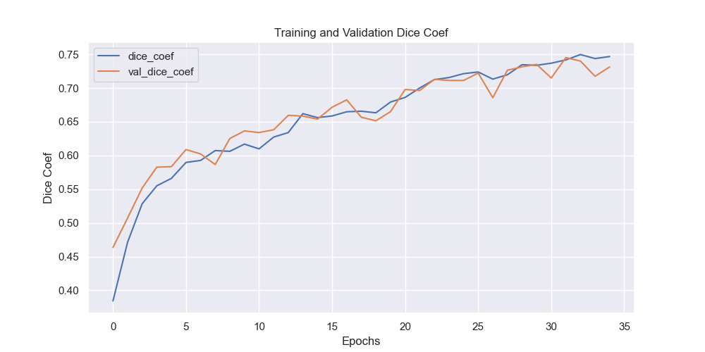
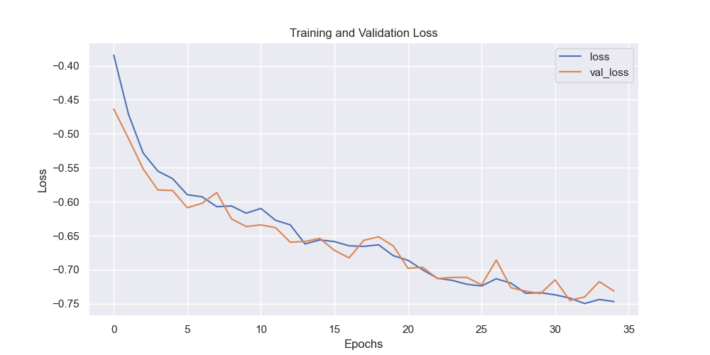

# Airbus ship detection challenge

This repository contains a u-net model semantic segmentation model for the [Airbus Ship Detection Challenge](https://www.kaggle.com/c/airbus-ship-detection/overview). The objective of the challenge is to create a model capable of precisely detecting ships within satellite imagery.

# Dateset
Please note that the training and test data are not included in this repository due to size limitations. However, you can download the dataset from the [Airbus Ship Detection Challenge](https://www.kaggle.com/c/airbus-ship-detection/overview). After downloading, unzip the dataset into the 'airbus_ship_detection_unet' directory in the root of this repository.

## Directory
After downloading and unzipping the dataset, the directory structure should look like this:

```
 ├── airbus_ship_detection_unet
     ├── train_v2
         └── ...
     ├── test_v2
         └── ...
     └── train_ship_segmentations_v2.csv
 ├──models
    ├──h5
    └──csv
├── train.py
├── test.py
├── metrics.py
├── encoding.py
├── EDA.ipynb
├── metrics.py
└── README.md
```

# Usage

The `train.py` and `test.py` scripts are independent and can be run separately. 

- **Training:**
  To train the model, execute the `train.py` script. The trained model parameters and training history are be stored in the `models` directory.

- **Testing:**
  To test the trained model, execute the `test.py` script. Make sure to adjust the script to load the trained model from the appropriate directory.

Ensure that all necessary dependencies are installed before running the scripts.

# Run

To train the model, run the following command in your terminal:

```
python3 train.py
```
To test provided solution run:
```
python3 test.py
```
Additionally, the following files are included in this repository:

EDA.ipynb: Contains exploratory data analysis.
encoding.py: Contains functions for RLE encoding, used for visualization in EDA.ipynb.
metrics.py: Provides the metrics used for model evaluation.
These files provide additional functionality and insights related to the project.

# Solution description
References, used for this solution are provided below.

The initial step involves preprocessing the dataset. Due to the large size of the dataset and its highly unbalanced nature, a subsample of 10,000 images was used for training and validation purposes. This size is controlled by the parameters `NUMBER = 10000` and `FRACTION_WITH_SHIPS = 0.75`, which determines the fraction of data with ships after undersampling.

- **Image and Mask Resizing:** The original images and masks, which were of size (768, 768), were resized to (256, 256) to expedite the training process.

- **U-Net Model:** The U-Net model, provided by [TODO], was implemented using TensorFlow for semantic segmentation tasks.

- **Model Performance Evaluation:** Dice coefficients and Dice Loss were utilized for evaluating the performance of the model. The Dice coefficient measures the similarity between two samples: the actual segmentation mask and the predicted segmentation mask.

- **Optimizer:** The model was trained using the "Adam" optimizer, with a dynamically adjusted learning rate. The learning rate adjustments were made using the `ReduceLROnPlateau` callback, which monitors the validation Dice coefficient (`val_dice_coef`). The learning rate was reduced by a factor of 0.5 if no improvement was observed for 3 consecutive epochs (`patience`).


8000 images were used for training, while 2000 images were reserved for validation. The model was trained for 35 epochs. The resulting Dice coefficient value for the validation dataset achieved by the model during validation is 0.74.

The dependency of the Dice coefficient for each epoch during training is provided below:

