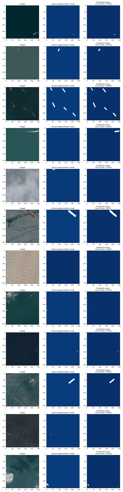

# Airbus ship detection challenge

This repository contains a u-net model semantic segmentation model for the [Airbus Ship Detection Challenge](https://www.kaggle.com/c/airbus-ship-detection/overview). The objective of the challenge is to create a model capable of precisely detecting ships within satellite imagery.

# Dateset
Please note that the training and test data are not included in this repository due to size limitations. However, you can download the dataset from the [Airbus Ship Detection Challenge](https://www.kaggle.com/c/airbus-ship-detection/overview). After downloading, unzip the dataset into the 'airbus_ship_detection_unet' directory in the root of this repository.

## Directory
After downloading and unzipping the dataset, the directory structure should look like this:

```
 ├── airbus_ship_detection_unet
     ├── train_v2
         └── ...
     ├── test_v2
         └── ...
     └── train_ship_segmentations_v2.csv
 ├──models
    ├──*.h5
    └──*.csv
├── train.py
├── test.py
├── metrics.py
├── encoding.py
├── ...
└── README.md
```

# Usage

The `train.py` and `test.py` scripts are independent and can be run separately.

### Training:

To train the model, execute the `train.py` script. The trained model parameters and training history are stored in the `models` directory.

During the training process, several files are generated in the `models` directory:
- **Model File:** `unet_segmentation{date-and-time-of-training}.h5` contains information about the trained model.
- **Training History:** `unet_segmentation{date-and-time-of-training}.csv` stores the training history data.
- **Prediction Comparison:** `prediction{date-and-time-of-training}.png` provides a comparison of a random sample from the validation dataset, including the original image, actual segmentation mask, and predicted segmentation mask.

### Testing:

To test the trained model, execute the test.py script. Ensure that you adjust the script to load the trained model from the appropriate directory.

The parameters for testing the trained model are loaded from the `models/unet_segmentation2024-02-29_23-46-48.h5` file (which was already prepared during training, you can substitute with your own trained model file). 

The images used for testing are sourced from the `airbus_ship_detection_unet/test_v2` directory. If you want to test the model using your own images, modify the `test_imgs` variable in `test.py` and provide your list of image filenames. Also, change the `test_image_dir` variable to specify the directory containing your test images.

# Run

To train the model, run the following command in your terminal:

```
python3 train.py
```
To test provided solution run:
```
python3 test.py
```
Additionally, the following files are included in this repository:

`EDA.ipynb`: Contains exploratory data analysis.
`encoding.py`: Contains functions for RLE encoding, used for visualization in EDA.ipynb.
`metrics.py`: Provides the metrics used for model evaluation.
These files provide additional functionality and insights related to the project.

# Solution description
References, used for this solution are provided below.

The initial step involves preprocessing the dataset. Due to the large size of the dataset and its highly unbalanced nature, a subsample of 10,000 images was used for training and validation purposes. This size is controlled by the parameters `NUMBER = 10000` and `FRACTION_WITH_SHIPS = 0.75`, which determines the fraction of data with ships after undersampling.

- **Image and Mask Resizing:** The original images and masks, which were of size (768, 768), were resized to (256, 256) to expedite the training process.

- **U-Net Model:** The U-Net model, provided by [2], was implemented using TensorFlow for semantic segmentation tasks.

- **Model Performance Evaluation:** Dice coefficients and Dice Loss were utilized for evaluating the performance of the model. The Dice coefficient measures the similarity between two samples: the actual segmentation mask and the predicted segmentation mask.

- **Optimizer:** The model was trained using the "Adam" optimizer, with a dynamically adjusted learning rate. The learning rate adjustments were made using the `ReduceLROnPlateau` callback, which monitors the validation Dice coefficient (`val_dice_coef`). The learning rate was reduced by a factor of 0.5 if no improvement was observed for 3 consecutive epochs (`patience`).


8000 images were used for training, while 2000 images were reserved for validation. The model was trained for 35 epochs. The resulting Dice coefficient value for the validation dataset achieved by the model during validation is 0.74.

The dependency of the Dice coefficient and Dice Loss for each epoch during training is provided below:


## Segmentation Mask Comparison
The comparison between predicted segmentation masks and actual masks for samples from the validation set is illustrated in the figure below:

The visualization demonstrates the model's performance in detecting images with and without ships. While the model can successfully identify images without ships, it faces challenges in accurately detecting ships of smaller sizes. This issue may stem from resizing the entire images during training.

A potential solution to improve the model's performance is to consider cropping the original images, ensuring that the ship remains in the center of the cropped file. This approach allows the model to focus on relevant areas while excluding unnecessary background information.

Additionally, it's noteworthy that the segmentation masks generated by the model exhibit irregular boundaries, unlike the rectangular shapes in the original masks. This discrepancy may impact the model's ability to precisely delineate ship boundaries.

It's essential to mention that for better prediction results, it is crucial to train the model on a larger dataset, include augmentation techniques, and train for a higher number of epochs.

# References
1. https://github.com/Andrii-Radyhin/Airbus-Ship-Detection-Challenge/
2. https://github.com/muratalkhadam/ship-segmentation
3. https://github.com/Spartificial/yt-acad-projs
4. https://medium.com/artificialis/detecting-ships-in-satellite-imagery-five-years-later-28df2e83f987